# HLD ドキュメント (High-Level Design Document)

# 目次

# [I. はじめに](#i-はじめに)

## [1.1. プロジェクトの目的](#11-プロジェクトの目的)

## [1.2. 適用範囲](#12-適用範囲)

## [1.3. 定義と略語](#13-定義と略語)

## [1.4. 主要要件](#14-主要要件)

# [II. システムの概要と主要コンポーネント](#ii-システムの概要と主要コンポーネント)

## [2.1. 概要](#21-概要)

## [2.2. ハードウェアの紹介](#22-ハードウェアの紹介)

## [2.3. アーキテクチャ図](#23-アーキテクチャ図)

# [III. データ収集と処理](#iii-データ収集と処理)

## [3.1. データ収集](#31-データ収集)

## [3.2 画像データのフィルタリング](#32-画像データのフィルタリング)

## [3.3. データラベリング](#33-データラベリング)

# [IV. AI モデルの学習](#iv-aiモデルの学習)

## [4.1. データ分割](#41--データ分割)

## [4.2. テストデータ](#42-テストデータ)

# [V. モデル変換 (Convert Model)](#v-convert-model-ai)

# [VI. 推論アプリケーション (Inference App)](#vi-inference-avi)

## [6.1. 概要](#61-概要)

## [6.2. アプリケーション利用ガイド](#62-アプリケーション利用ガイド)

# [VII. 技術とプラットフォーム](#vii-技術とプラットフォーム)

# [VIII. 外部インターフェース](#viii-外部インターフェース)

# [IX. 構成設定](#ix-構成設定)

# [X. エラー処理 (Error Handling)](#x-error-handling)

# [XI. 非機能要件](#xi-非機能要件)

# [XII. 付録](#xii-付録)

## I. はじめに

### 1.1. プロジェクトの目的

このプロジェクトは、AI をお客様提供のハードウェアと統合することで、**走行中の自転車が歩道または車道にいるかを検出**することを目的としています。
お客様提供のハードウェアは以下を含みます。

1. ハードウェアボード: Rockchip RK1808 EVB V10 Board
2. カメラモジュール

このプロジェクトでは、以下の 2 つのアプリケーションを開発する必要があります。

- **データ収集ソフトウェア (Collect data software)**: データ収集、画像撮影、メモリへの保存をサポートするアプリケーション。
- **メインソフトウェア (Main software)**: 走行中の自転車が歩道または車線にいるかを検出するアプリケーション。

### 1.2. 適用範囲

#### データ収集

- **場所**: 日本 - お客様から具体的なデータ収集場所が提供されています。

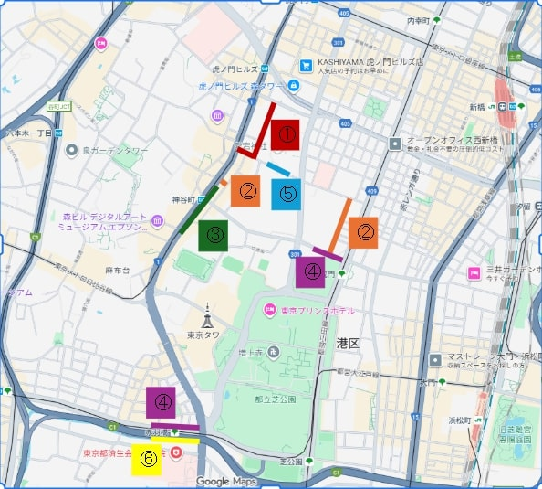

- **収集が必要な画像数**: 目標: 10000 枚のオリジナル画像 (**raw images**)。
- **使用する画像数**: 4500 枚の画像。
- **データ収集シナリオ**: [Scenario](https://docs.google.com/spreadsheets/d/1dLg0KzIUWV-L5fPBXcsZgAe5XzseXncuVe0B2Jg_9lE/edit?gid=0#gid=0)。

#### AI モデルの学習

- **セマンティックセグメンテーション用の AI モデル**: DDRNet23-Slim を使用。

#### アプリケーションのデプロイ

お客様提供のハードウェアデバイスにアプリケーションをデプロイするため:

- モデルを**RKNN**形式に変換。

### 1.3 定義と略語

| Word   | Explain                    | Meaning                          |
| ------ | -------------------------- | -------------------------------- |
| Device | Device                     | お客様提供のハードウェアデバイス |
| EMA    | Exponential Moving Average | 平滑化を支援するアルゴリズム     |
| PC     | Pesonal Computer           | パーソナルコンピュータ           |

### 1.4. 主要要件

- 車線と歩道を**区別**できること。
- 走行中の自転車の**相対的な位置** (歩道または車道のどちらを走行しているか) を特定できること。
- モデル評価を行うために、処理後の画像を**保存**できること。
- **処理速度**: 最低 2fps。

## II. システムの概要と主要コンポーネント

### 2.1. 概要

システムは、**データ収集**、**AI モデル**、**アプリケーション開発**の 3 つの主要フェーズに分けられます。

システムは 2 つの部分で構成されます。

- **Device**: ハードウェアボード + カメラ。
- **PC**: ADB Interface を介してデバイスに接続でき、デバイスへのアクセス、制御、情報抽出が可能。

### 2.2 ハードウェアの紹介

#### 2.2.1 ハードウェア仕様

- **デバイス**: Rockchip RK1808 EVB V10 Board
- **プロセッサ**: Rockchip RK1808 NPU、性能: 3 TOPS (Trillions of Operations Per Second)
- **サポート**: INT8, INT16, FP16 quantization
- **RAM**: 2 GB
- **メモリ**:
  - Root filesystem: 2.6 GB (空き 1.3 GB)
  - User data: 4.0 GB (空き 1.7 GB)
- **オペレーティングシステム (OS)**: Linux Embedded

#### 2.2.2 フォルダ構造

```
/userdata/
├── models/
│ └── ddrnet_rk1808.rknn (AI モデルファイル - 削除禁止)
│
├── captures/ (全てのデータを含むルートディレクトリ)
│ ├── captures1/ (セッション 1)
│ │ ├── raw/ (カメラからのオリジナル画像)
│ │ ├── segmented/ (セグメント化されたカラー画像)
│ │ ├── overlay/ (オリジナル画像とセグメント画像を結合した画像)
│ │ └── position.log (位置ログ)
│ │
│ └── captures2/ (セッション 2)
│     └── ...
│
└── service/
├── config.json (構成ファイル - 重要)
├── service.py (プログラムコード)
└── model.py (モデルロードプログラム)
```

### 2.3. アーキテクチャ図


#### 2.3.1 デバイスと PC 間の相互作用フロー

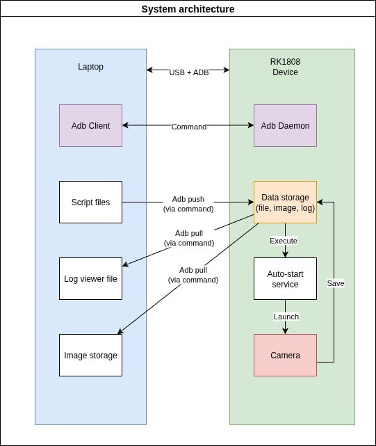

## III. データ収集と処理

### 3.1 データ収集

データ収集アプリケーション (Collect Data Software) は、カメラから自動的に画像を連続で**5 秒周期**で撮影し、リアルタイムのタイムスタンプをファイル名として保存します。

#### 3.1.1. 主要機能

- 定期的な自動画像撮影。
- リアルタイム (タイムスタンプ) に基づく画像の保存と命名。
- 撮影前のディスク容量の確認。
- ディスク容量が許容しきい値よりも低くなった場合の自動停止。

#### 3.1.2. 運用手順

RK1808 デバイスは、電源が供給されるとすぐに自動撮影スクリプトを実行するように構成されます。スクリプトは手動介入なしに起動し、独立して動作します。アプリケーションの運用手順は以下の通りです。

1. **自動起動**:
   電源ケーブルが接続されると、デバイスは自動的にアプリケーションを実行します。
2. **構成設定**:
   ADB Interface を使用して PC と接続します。
3. **スクリプトのデプロイ**:
   プログラムと構成設定を ADB 経由でデバイスにプッシュします。
4. **監視**:
   ADB 接続を介してログと動作状況を確認します。

#### 3.1.3. アプリケーションのブロック図

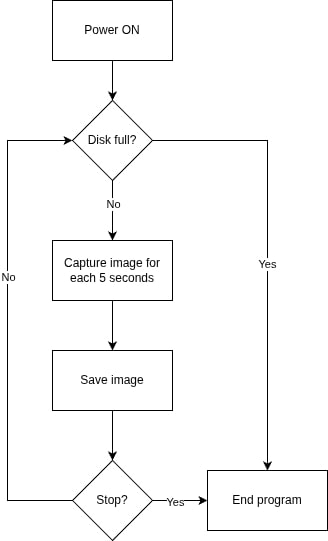

#### 3.1.4. デバイスに必要なライブラリ

| Component               | Technology                  |
| ----------------------- | --------------------------- |
| Programming Language    | Python 3.x                  |
| Computer Vision Library | OpenCV (cv2)                |
| Operating System        | Linux-based (userdata path) |
| Camera Interface        | Video4Linux (V4L)           |

#### 3.1.5. アプリケーションのインストール準備ガイド

**Windows OS へのインストール**

_Android SDK Platform-Tools の使用_

1. SDK Platform-Tools のダウンロード:

   - アクセス: [Platform Tool](https://developer.android.com/tools/releases/platform-tools)
   - Windows OS 用のアプリケーションファイルをダウンロードします。
   - PATH への追加:

     `Win + X` を押します。

     `System` を選択します。

     `Advanced system settings (システムの詳細設定)` を選択します。

     `Environment Variables (環境変数)` をクリックします。

     `System variables (システム環境変数)` で、`Path` を見つけて選択 -> `Edit (編集)` をクリックします。

     `New (新規)` をクリックし、`C:\platform-tools` を追加します。

     `OK` をクリックします。

   - インストールの確認

     `Windown` ボタンを押します。

     補助アプリケーション **Power Shell** を検索して入力します。

     `Enter` を押します。

     アプリケーションウィンドウで次のコマンドを実行します。

     ```
     adb version
     ```

     アプリケーション情報が画面に表示されれば、アプリケーションが正常にインストールされたことを示します。

**Linux (Ubuntu/Debian) へのインストール**

1. パッケージリストの更新

   ```bash
   sudo apt update
   ```

2. adb のインストール

   ```bash
   sudo apt install adb -y
   ```

3. バージョンの確認

   ```
   adb version
   ```

#### 3.1.6. デバイスへのアプリケーションのインストール

**1. プログラムを PC にダウンロード**

ソースコードを以下からダウンロードします: [Collect data application](https://git.hblab.vn/rnd/pro-1769-bike-camera-segmentation.git)

**2. ソースコードの解凍**

PC に組み込まれているツールを使用して、ダウンロードしたファイルを解凍します。

**3. デバイスと PC の接続**

- 電源を接続し、USB ポート経由でデバイスを PC に接続します。
- PC で**Terminal** または **Power Shell** を開きます。
- 次のコマンドでデバイスと PC 間の接続を確認します。

```
adb devices
```

- デバイスが接続に失敗した場合:

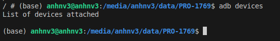

**4. アプリケーションのインストール**

- Terminal にデバイスが表示されたら、次のコマンドを実行します。

```
adb push {path/to/service/code/file} userdata/
```

**デバイスの再起動 (Reboot)**

**方法 1**: デバイスの電源を抜き、再度差し込みます。

**方法 2**: **Console**で次のコマンドを実行します。

```
adb shell reboot
```

**デバイスが動作していることの確認**
次の手順で `log file` を確認します。

PC の**Console**で次のコマンドを実行します。

```
adb pull userdata/app_log.txt {path/to/save (optional)}
```

**5. デバイスから PC への画像の取得**

データ収集後、以下の手順に従って画像をデバイスから PC に取り込み、処理することができます。

**ステップ 1**: [デバイスと PC の接続](#316-デバイスへのアプリケーションのインストール)のガイドと同様に、デバイスを PC に接続します。

**ステップ 2**: 次のコマンドを実行して画像を PC にダウンロードします。

```
adb pull userdata/captures {path/to/save (optional)}
```

_Note_:

`adb pull`: ファイル/フォルダをデバイスから PC にダウンロード
`adb push`: ファイル/フォルダを PC からデバイスにアップロード

**6. 画像の削除**

**ステップ 1**: [デバイスと PC の接続](#316-デバイスへのアプリケーションのインストール)のガイドと同様に、デバイスを PC に接続します。

**ステップ 2**: 次のコマンドを実行して画像を含むフォルダを削除します。

```
adb shell "rm -r userdata/captures"
```

### 3.2 画像データのフィルタリング

ラベリングの前に画像データをフィルタリングすることで、ノイズ画像、低品質画像、重複データを削除できます。これにより、ラベルの正確性が保証され、時間とコストが節約されます。さらに、クリーンなデータは、より高い精度と実使用時の優れた汎化能力を持つ AI モデルを生成します。

データフィルタリングの方法:

- 重複画像の削除
- 低品質画像の削除
- 外れ値データの削除

### 3.3 データラベリング

データがフィルタリングされた後、ラベリングに進みます。
目標: 4500 枚の画像。

市場で入手可能なアノテーション支援ツールを使用します。

#### 3.3.1 アノテーションガイド

現在の課題では、以下の 3 つのラベルが領域としてアノテーションされます。

1. Road (車道)
2. Side walk (歩道)
3. Other (その他)

#### 3.3.2 ラベルのルール

##### 3.3.2.1 セグメント AI モデル用のアノテーション

**Road (車道):**

1. 車両（自転車、自動車、バイクなど）が一緒に走行するエリア。
2. ガードレールの右側のエリア。

**Side Walk (歩道):**

1. 歩行者専用エリアで、道路の両側に沿って主道路よりも高い部分。
2. 自転車が走行できる歩道部分も**歩道**として認識します。
3. 歩道は通常、ガードレールの左側にあります。

**Other (その他):**

1. _Road_ と _Sidewalk_ が認識された後の残りのエリア。

**Example:**

_Note:_

- Pink: Side walk
- Grey: Road
- Black: Other

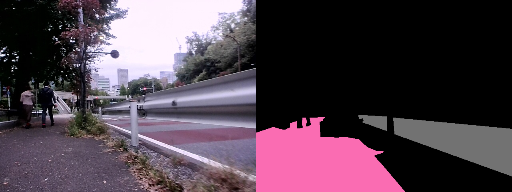

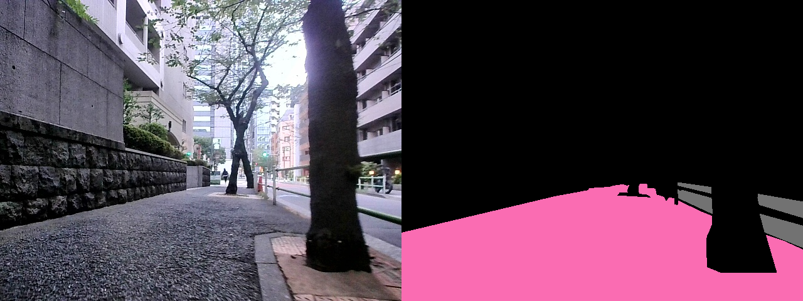

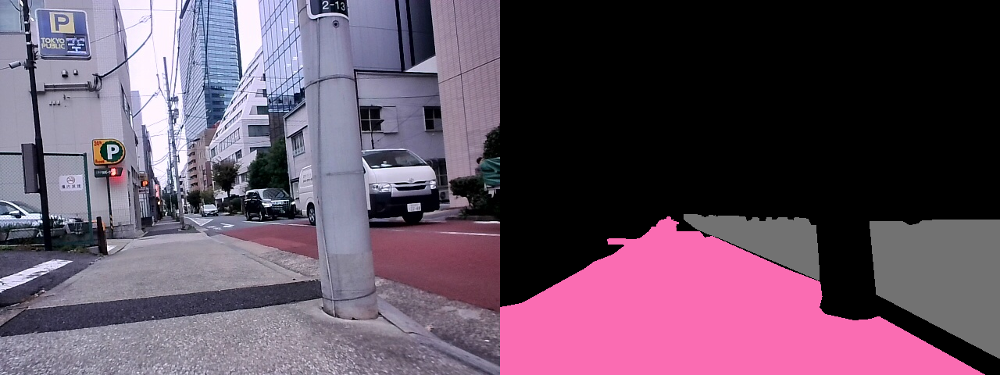

##### 3.3.2.1 自転車の位置のアノテーション

データ収集の結果に基づいて、収集された画像にラベルを付けるツールを使用します。

**Example:**

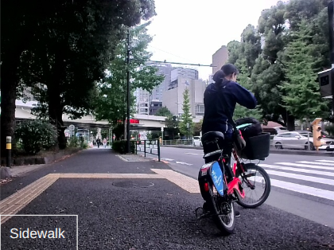

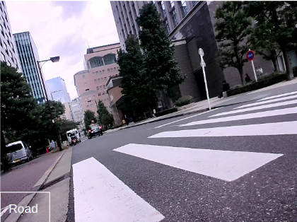

## IV. AI モデルの学習

### 4.1 データ分割

画像データは 2 つの部分に分割されます。

- Dataset for training (学習用データセット)。
- Dataset for testing (テスト用データセット)。

#### 4.1.1 学習データ (Data for training)

モデルの学習に使用される画像データ:

- **数量**: 6700 枚の画像
- **内訳**: 収集済みデータからの 3800 枚の画像 (アノテーションが必要) と、公開データからの 2900 枚の画像 (アノテーションは不要)。

#### 4.1.2 テストデータ (Data for testing)

検証に使用される画像データは 2 種類に分けられます。

- セグメント AI モデル検証用データ。
- 自転車の位置特定部分の検証用データ。

**モデル検証用データ**

検証用データは、さらに異なるシナリオごとに分割されます。各シナリオごとの画像数は [こちら](https://docs.google.com/spreadsheets/d/1dLg0KzIUWV-L5fPBXcsZgAe5XzseXncuVe0B2Jg_9lE/edit?gid=0#gid=0) を参照してください。

**自転車の位置特定部分の検証用データ**

- **数量**: 600 枚の画像。

## V. AI モデル変換

ハードウェアデバイスでモデルを使用できるようにするため、モデルは次のように変換される必要があります。


## VI. 推論アプリケーション (INFERENCE APP)

### 6.1 概要

アプリケーションには以下の主要な機能があります。

- カメラからの画像データの取得
- AI モデルによる処理
- 自転車の位置検出とデータの保存

**アプリケーションの動作フロー**


#### 6.1.1 カメラからの画像データの取得

- 設定ファイルの読み込み
- カメラによる画像撮影
- 設定ファイルに基づく画像の処理 (リサイズ)
- 設定ファイルの情報に基づく画像の保存

#### 6.1.2 AI モデル

後処理 (post-processing) を経た画像は、AI モデルに入力され、**road** (車道) と **sidewalk** (歩道) の位置を特定します。

**結果**: 各画像ピクセルに `road`, `side`, `other` のラベルが付けられます。

#### 6.1.3 自転車の位置検出とデータの保存

##### 6.1.3.1 自転車の位置の特定

**road** (車道) と **sidewalk** (歩道) の位置が検出された後、ヒューリスティックのみの方法を使用して自転車の位置を特定します。

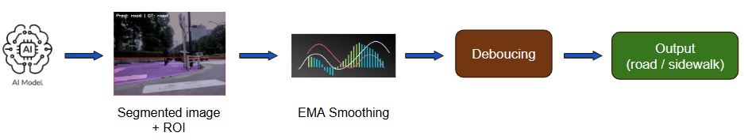

**車両の位置特定**

処理フロー:

- 必要な情報が多く含まれる画像領域を切り取ります。
- `road` と `side walk` のラベルが付けられたピクセル数を計算します。
- 次の式を計算します: $$ ratio = {road\over road+sidewalk}$$

- **決定**:

`threshold = 0.6` に設定

$ratio \ge threshold$ : 車両は**車道**を走行中

$ratio < thresold$: 車両は**歩道**を走行中

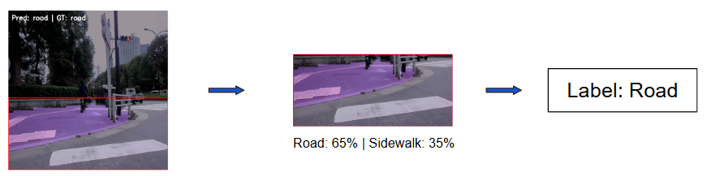

##### 6.1.3.2 実走行中の精度の向上

車両が走行しているため、画像が揺れる、ぼやける、ノイズが発生する、または一時的にカメラの位置がずれるなどのケースは避けられず、AI が一部のフレームで誤った評価を下す可能性があります。自転車の位置検出の精度を向上させるため、以下の処理プロセスを提案します。

**EMA (指数移動平均) 平滑化手法**

この手法は、前のフレームに基づいて各フレームの **ratio** を調整するのに役立ちます。

処理フロー:

- 5 番目のフレームから開始します。
- 次の式に従って、各フレームの `ratio` を再計算します。
  $$ r_i = 0.2(r_i + r_{i-1}+ r_{i-2}+r_{i-3}+r_{i-4})$$
- 新しい `ratio` 値を画像に割り当てます。

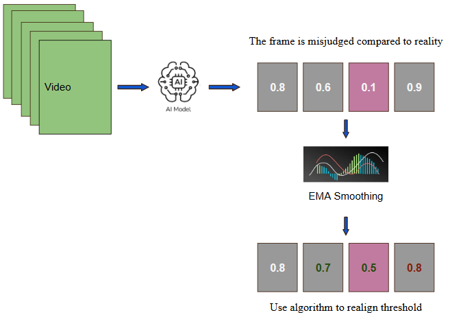

**デバウンス (Debouncing) 手法**

この手法は、前のフレームのデータに基づいてフレームにラベルを再割り当てするのに役立ちます。
EMA からデータを取得した後で処理されます。

処理フロー:

- 4 番目のフレームから開始します。
- 位置ラベルの評価:

もし $(r_{i-1}) \& (r_{i-2}) \& (r_{i-3}) \ge threshold$: 位置は `road`

もし $(r_{i-1}) \& (r_{i-2}) \& (r_{i-3})< threshold$: 位置は `sidewalk`

もし $(r_{i-1}) || (r_{i-2}) || (r_{i-3})< threshold$: 位置は **ratio** に基づいて決定されます。

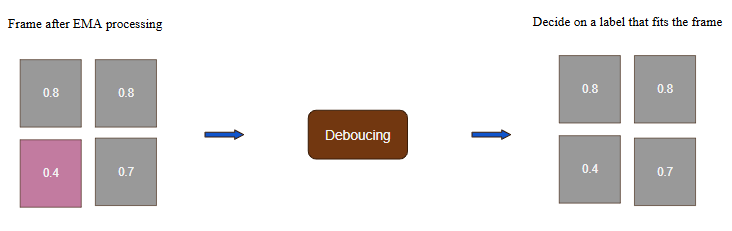

##### 6.1.3.3 データをメモリに保存

処理が完了した後、アプリケーションは情報をメモリに保存します。保存される情報には以下が含まれます。

- オリジナル画像 (**raw image**)
- セグメント化後の画像 (**segmented image**)
- オリジナル画像とセグメント化画像を組み合わせた画像 (**overlay image**): 結果評価をサポートするため
- **Position log**: `image_name + lable` の形式での自転車の位置
- **App log**: デバイスの活動ログ。

情報は対応するフォルダに保存されます: [フォルダ構造](#222-フォルダ構造)

### 6.2 アプリケーション利用ガイド

**ステップ 1**: アプリケーションのインストール

[インストールガイド](#316-デバイスへのアプリケーションのインストール)に従ってアプリケーションをインストールします。

**ステップ 2**: 設定ファイルの更新

`config` ファイルは、PC 上で次の形式で作成する必要があります。

`.json` ファイル形式

```json
{
  "mode": "running",
  "processing_mode": "capture-segment",
  "model_path": "/userdata/models/ddrnet_rk1808.rknn",
  "base_dir": "/userdata/captures",
  "interval": 0.5
}
```

| Key             | Value                                                                                                                    |
| --------------- | ------------------------------------------------------------------------------------------------------------------------ |
| mode            | 動作モード: <br> `running`: プログラムを実行 paused <br> `paused`: プログラムを一時停止 <br> `stopped`: プログラムを終了 |
| processing_mode | 処理モード: <br> `capture-only`: 画像データ収集のみ <br> `capture-segment`: 推論アプリケーション                         |
| model_path      | モデルが保存されているディレクトリへのパス                                                                               |
| base_dir        | 処理後の画像が保存されるディレクトリへのパス                                                                             |
| interval        | 連続する 2 回の画像撮影間の時間。単位: `秒`                                                                              |

**ステップ 3**: 設定ファイルをデバイスにプッシュ

PC 上の設定ファイルを含むフォルダで、**Console** を開きます。

実行:

```
adb push path/to/config/file userdata/service/config.json
```

アプリケーションは設定ファイルに従って動作します。

## VII. 技術とプラットフォーム

### 1. ハードウェアデバイス

- 電源ユニット
- RK1808 デバイス (Rockchip AI Processing Unit)
- カメラモジュール (カメラ ID: 6)
- ストレージメモリ: /userdata

### 2. パーソナルコンピュータ (PC)

- OS: Linux/Windows/MacOS
- ツール: ADB (Android Debug Bridge)

### 3. デバイスで使用される技術

- プログラミング言語: Python 3.x
- 画像処理ライブラリ: OpenCV (cv2)
- ロギング: Python logging module
- デバイス OS: Linux-based
- 接続インターフェース: ADB (Android Debug Bridge)

## VIII. 外部インターフェース

- グラフィカルユーザーインターフェースはありません
- ログファイルと Console を介して対話します

## IX. 構成設定

| パラメータ           | 値                            | 説明                           |
| -------------------- | ----------------------------- | ------------------------------ |
| CAMERA_ID            | 6                             | デバイス上のカメラの ID        |
| SAVE_PATH            | `/userdata/captures/`         | 画像の保存パス                 |
| LOG_FILE             | `/userdata/app_log.txt`       | ログファイルのパス             |
| CAPTURE_INTERVAL     | 5 秒                          | 画像撮影の周期                 |
| MIN_FREE_SPACE_MB    | 1000 MB                       | 最小許容ディスク容量のしきい値 |
| APPROX_IMAGE_SIZE_KB | 100 KB                        | 各画像の推定サイズ             |
| ファイル形式         | `capture_YYYYMMDD_HHMMSS.jpg` | 画像ファイル名の形式           |

## X. エラー処理

| エラータイプ     | 検出                             | 処理                                               |
| ---------------- | -------------------------------- | -------------------------------------------------- |
| カメラが利用不可 | ` cap.isOpened() == False`       | エラーログを記録してプログラムを終了               |
| フレーム撮影失敗 | `ret == False`                   | エラーログを記録してループを続行                   |
| ディスク容量不足 | `free_space < MIN_FREE_SPACE_MB` | 警告ログを記録して撮影を停止                       |
| 未定義のエラー   | `Exception`                      | エラーログを記録し、カメラを閉じ、プログラムを終了 |

## XI. 非機能要件

### 1. パフォーマンス

- 各画像撮影時間: < 1 秒
- 撮影周期: 5 秒/画像
- 画像サイズ: 約 100 KB/画像
- 推定ストレージ容量: 100 枚の画像で約 10 MB

### 2. 信頼性

- 撮影前にディスク容量を自動チェック
- 追跡とデバッグのための完全なロギング
- クラッシュを避けるための例外処理 (exception handling)

### 3. 保守性

- コードが明確で読みやすい構造
- 構成パラメータがファイルの先頭に集中
- トラブルシューティングを支援する詳細なロギング

### 4. プロジェクト目標 (メインソフトウェア - AI モデル)

- 精度: 独立したテストデータセットで mIoU >= 70%
- 処理時間: RK1808 上でのリアルタイム推論 (Inference)
- モデル形式: ONNX

## XII. 付録

### 1. ログ出力例

```
2025-10-17 09:00:00 - INFO - Vision app started...
2025-10-17 09:00:00 - INFO - Camera ID: 6
2025-10-17 09:00:00 - INFO - Save path: /userdata/captures/
2025-10-17 09:00:00 - INFO - Capture interval: 5 seconds
2025-10-17 09:00:00 - INFO - Minimum free space threshold: 1000 MB
2025-10-17 09:00:00 - INFO - Initial free disk space: 5234.56 MB
2025-10-17 09:00:00 - INFO - Estimated max images before threshold: ~43345
2025-10-17 09:00:01 - INFO - Camera opened successfully
2025-10-17 09:00:01 - INFO - Captured #1: /userdata/captures/capture_20251017_090001.jpg
2025-10-17 09:00:06 - INFO - Captured #2: /userdata/captures/capture_20251017_090006.jpg
...
2025-10-17 09:00:51 - INFO - Captured #10: /userdata/captures/capture_20251017_090051.jpg (Free: 5233.56 MB)
```

### 2. 便利な ADB コマンド

```bash
# デバイス接続の確認
adb devices

# 空き容量の確認
adb shell df -h /userdata

# リアルタイムログの表示
adb shell tail -f /userdata/app_log.txt
```
