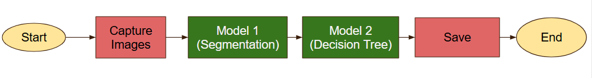
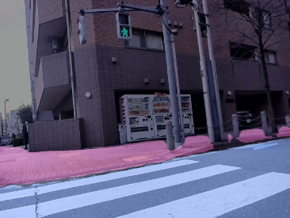
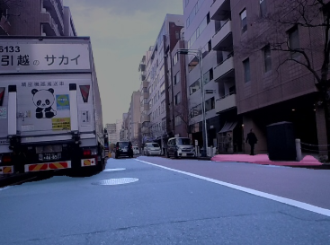
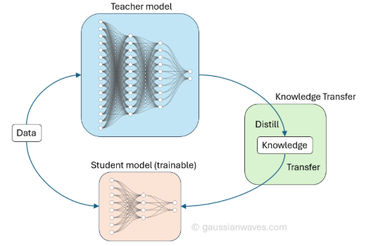

# PROPOSAL FOR NEXT PHASE

## 1. Tình trạng hiện tại

### 1.1 Độ chính xác hiện có

**Phương pháp hiện tại:**

Chương trình hiện tại đang được thực hiện theo basic flow như sau:

| Step | Description |
|-----|-----|
| Start | Ứng dụng có chức năng *tự động running ngay sau khi cấp nguồn |
| Capture Images| Chụp ảnh. **Intervals default:** 0.5s |
| Model 1 | Mô hình segmentation giúp phát hiện khu vực vỉa hè/lòng đường trong ảnh.   **Mô hình sử dụng:** DDRNET-23-Slim |
| Model 2 | Mô hình học máy giúp phát hiện vị trí xe đạp.   **Mô hình sử dụng:** Decision Tree|
| Save | Lưu dữ liệu bao gồm: ảnh trước khi xử lý, ảnh sau khi xử lý, logfile |
| End | Ứng dụng chỉ dừng lại khi bộ nhớ đầy |

**Kết quả hiện có:**

Kết quả khách hàng mong đợi với tập dữ liệu có sẵn:

| Label | Độ chính xác |
|-----|-----|
| mIoU sidewalk + road | 70% |
| mIoU overall | 70% |
| Bike location| 70% |

Cho đến hiện tại, kêt quả chúng tôi đạt được với tập dữ liệu có sẵn:

| Label | Độ chính xác |
|-----|------|
| mIoU sidewalk + road | 76.77% |
| mIoU overall | 76.68% |
| Bike location| 92.50%  |

Với tập dữ liệu bao gồm **700 ảnh** thu thập từ đường phố khách hàng yêu cầu và các khu vực lân cận. Tập datatest này bao gồm 5 kịch bản khác nhau: ngày/đêm, sáng/tối, quang đãng/có mưa, đường phố đông đúc/vắng vẻ.

Chúng tôi cũng đã thực hiện đánh giá ứng dụng với dữ liệu thực tế và kết quả như sau:

* Ảnh thu được: 14440 ảnh.
* Ảnh annotatation: 14440 ảnh (chỉ annotate với label vị trí xa đạp)
* Kết quả: độ chính xác vị trí xe: **91.41%**

### 1.2 Các case đã xử lý tốt

Mô hình segmentation hiện tại có thể xử lý rất tốt các case khi phương tiện `đang di chuyển` trên đường hoặc vỉa hè. Điều này có thể thể giải thích như sau:
* Tại các vị trí này, phần đường và vỉa hè được trải thẳng, có người hoặc phương tiện giao thông đang di chuyển, có hàng rào hoặc cây cối giúp mô hình có thể nhận ra chính xác vị trí đường và vỉa hè.
* Example:

### 1.3 Các case xử lý chưa tốt
Sau khi đánh giá, chúng tôi nhận thấy mô hình segmentation vẫn chưa xử lý tốt tại các case sau:

* Vùng diện tích vỉa hè hoặc lòng đường quá bé và không có dấu hiệu khác để nhận biết.

* Mô hình không phân biệt được được và vỉa hè:

## 2. Đề xuất phương án cải thiện tại phase sau

### 2.1 Cập nhật dữ liệu

* Theo chúng tôi quan sát, hiện tại khi ảnh chụp được mà phần lòng đường và vỉa hè có đủ các dấu hiệu quan sát thì mô hình sẽ gặp khó khắn trong quá trình phân tích. Điều này có thể chứng minh rằng kể cả các vùng ảnh nhỏ, nhưng có dấu hiệu (như hàng rào) thì mô hình vẫn có thể xử lý tốt (như ảnh xác định vỉa hè ở trên). Và khi không có hoặc có nhiều thì có thể kiến mô hình hoang mang và label khó hiểu.

* Điều này có thể hiểu là đến từ việc phân bố cho các dữ liệu này trong dữ liệu huấn luyện vẫn còn quá thấp, mô hình bị lệch (bias) bởi những đặc điểm như người đi bộ, xe ô tô, ... Hầu hết các ảnh dễ bị label sai khi ở các vị trí lạ (xe qua đường, ...). Chúng tôi đề xuất tăng cường các dữ liệu như vậy trong dữ liệu huấn luyện.

* Chúng tôi cũng đồng ý rằng, thời tiết, và phần nào là độ sáng tối không quá ảnh hưởng đến kết quả chung (như các kết quả đã đánh giá). Để cải thiện, ta cần bổ sung dữ liệu vào các scenerior vắng vẻ xe cộ và người đi đường, ..., cần bổ sung các scenerior đặc biệt làm đa dạng phân bố dữ liệu, thêm các dữ liệu được thu thập tại vùng có kẻ đường hoặc các đường khó nhận dạng.

### 2.2 Cập nhật thuật toán

* Chúng tôi cũng có nghi ngờ rằng, 1 lý do của các lỗi đã nêu trên nằm ở việc mô hình sử dụng chưa đủ lớn để học được các đặc điểm cần thiết, và việc sử dụng mô hình lớn hơn có thể gây rắc rối về vấn đề thời gian xử lý. Điều này dẫn đến cho chúng tôi đề xuất về phương pháp `distillation`. Các áp dụng đơn giản nhất là sử dụng tập dữ liệu hiện tại để huấn luyện 1 mô hình lớn hơn, sau đó tiến hành đánh giá. Nếu mô hình lớn hơn này đạt kết quả tốt ở các case khó, ta có thể sử dụng để tạo sinh dữ liệu `synthesis` dựa trên dữ liệu đường phố đã chụp được hiện tại để đa dạng dữ liệu và dùng để huấn luyện mô hình nhỏ.

* Độ chính xác kì vọng: **94%**

* Tuy nhiên, phương pháp này sẽ tốn thời gian nghiên cứu, tinh chỉnh và huấn luyện 2 mô hình (Teacher/Student) và sẽ tốn thời gian, chúng tôi đề xuất sẽ triển khai vào phase tới.

### 2.3 Mở rộng tính năng cho ứng dụng

Ngoài mục đích phát hiện vị trí sẽ đạp di chuyển trên làn đường hay trên vỉa hè, ứng dụng có thể mở rộng thành: phát hiện làn đường xe đạp được phép di chuyển.
Với tính năng này chúng tôi dựa trên các thông tin đã có, đề xuất phát triển các mục chính:
* Đọc làn đường
* Phân biệt làn đường dành cho xe máy. ô tô
* Đọc biển báo
* Đọc hình ảnh dưới làn đường
* Nhận biết khu vực nhập làn cao tốc